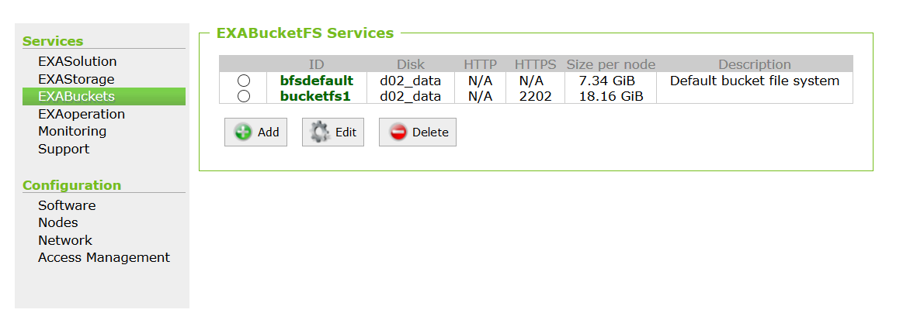
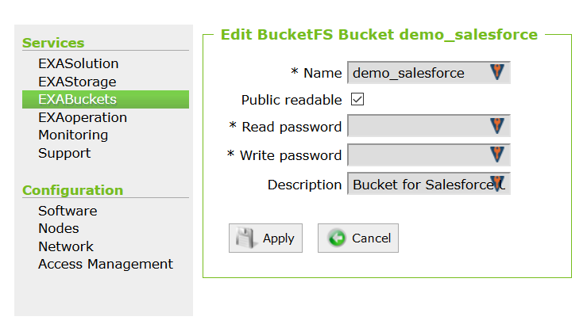
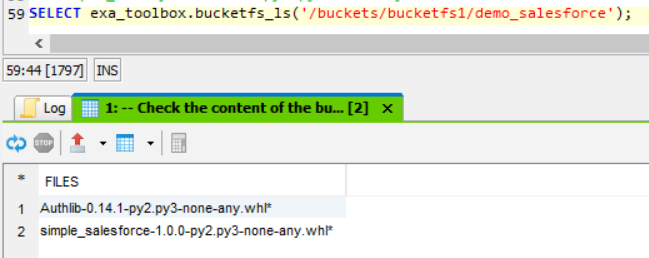

# Table of Contents

<!-- toc -->

- [Load data from Salesforce](#load-data-from-salesforce)
  * [Deployment](#deployment)
  + [Prerequisites](#prerequisites)
  * [Usage](#usage)
    + [Simple example](#simple-example)
    + [Advanced example](#advanced-example)

<!-- tocstop -->

# Load data from Salesforce
This document contains instructions and examples of how to load data directly
from Salesforce into Exasol, without any additonal tools.

This is achieved by using a UDF written in Python. This UDF makes use of the
simple-salesforce library in order to connect to Salesforce.

## Deployment

### Prerequisites
The simple-salesforce library is not shipped with Exasol by default. Therefore,
the first thing we need to do is to include the library. This can be done by
building a new python flavour or by uploading the .whl files to BucketFS directly.
We will use the second possibility here.

#### Create bucket
Therefore, please create a new bucket via Exaoperation.
1. Open Exaoperation
2. Go to Services --> EXABuckets
3. You might want to create a second BucketFS service if you have only the default one.
How to do this is explained [here](https://docs.exasol.com/database_concepts/bucketfs/create_new_bucketfs_service.htm). Make sure to configure a HTTP or HTTPS port so that you can later on put files into your bucket.


4. Click onto the newly created BucketFS service (most likely named bucketfs1)
and create a new bucket inside the service like explained [here](https://docs.exasol.com/database_concepts/bucketfs/create_new_bucket_in_bucketfs_service.htm). Make sure you
check 'Public readable'.



#### Upload .whl files to bucket
Once the bucket is created, you need to download two .whl files:
- `simple_salesforce-1.0.0-py2.py3-none-any.whl` from [here](https://pypi.org/project/simple-salesforce/#files)
- `Authlib-0.14.1-py2.py3-none-any.whl` from [here](https://pypi.org/project/Authlib/#files)

Upload these two to you newly created bucket, either via curl or by using the
BucketFS-Explorer that can be
downloaded [here](https://github.com/exasol/bucketfs-explorer) under 'Getting started' -->  'bucketfsexplorer-0.0.1-SNAPSHOT-jar-with-dependencies.jar'.

#### Check if you successfully uploaded the files
After uploading the files to BucketFS, they are synced to all database nodes. So now you
can access the files from inside a UDF. There is a simple way to check whether your files are available in the place you want them to be:
Copy the script [bucketfs_ls.sql](../utilities/bucketfs_ls.sql) to your SQL editor,
create it and call it with a command similar to this one (adapt it to your bucketname):
```SQL
SELECT exa_toolbox.bucketfs_ls('/buckets/bucketfs1/demo_salesforce');
```
The output should looke like this:



Remember this path, we will later on include it in the script

## Usage
This section contains different examples. The first one is a basic one to explain
the functionality and to show you how you can easily get started with creating your
own custom UDF to load from Salesforce. The second example is a more generic approach.
### Simple example
Open the file [salesforce_udf_simple_example.sql](./salesforce_udf_simple_example.sql) in
your SQL client. Change the line `sys.path.extend(glob.glob('/buckets/bucketfs1/demo_salesforce/*'))` so that it matches your bucket-path (see section [Check if you successfully uploaded the files](#check-if-you-successfully-uploaded-the-files) and create the function `SALESFORCE_UDF`.

Then create a table containing the
Salesforce credentials.

> :warning: Putting passwords into a table in plain text is not a best practice and should be avoided. So do this for a Salesforce demo account only. In the second example, you will see how to properly encapsulate your passwords into a connection

Then you're ready to call the UDF:
```SQL
select salesforce_udf(username, password, security_token)
from sf_credentials;
```


### Advanced example
The advanced example follows a more generic approach. Here you won't specify
each column that should be emitted but all the columns for a specific Salesforce object
type will be emitted.
This example consists of two files:
- A file acting as a library [salesforce_udf_library.sql](./salesforce_udf_library.sql)
- A file containing the concrete implementations for the different Salesforce objects [salesforce_udf_get_objects.sql](./salesforce_udf_get_objects.sql)

Please create the UDF contained in the library file first, then you're good to go and create the functions contained in the get_objects file.
For both files, always make sure that you change the line 

`sys.path.extend(glob.glob('/buckets/bucketfs1/demo_salesforce/*'))` 

so that it matches your bucket-path (see section [Check if you successfully uploaded the files](#check-if-you-successfully-uploaded-the-files)).
