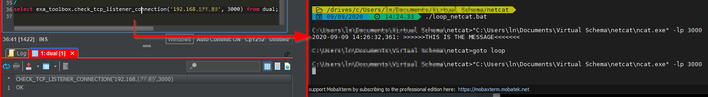
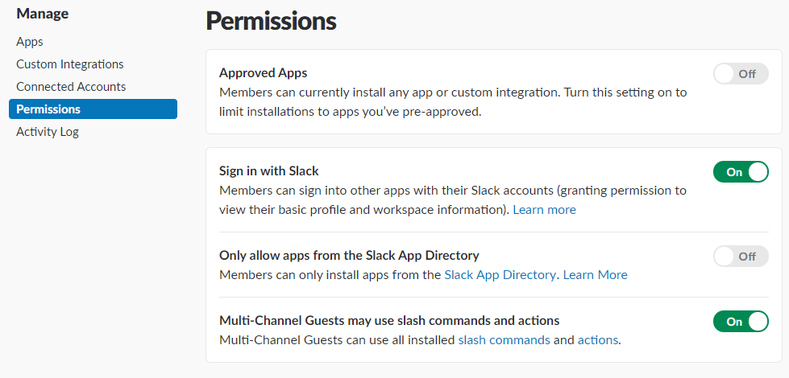

# Table of Contents

<!-- toc -->

- [Utilities](#utilities)
  * [bucketfs_ls](#bucketfs_ls)
  * [check_connectivity](#check_connectivity)
  * [check_tcp_listener_connection](#check_tcp_listener_connection)
  * [confd_xmlrpc](#confd_xmlrpc)
  * [upload_github_release_file_to_bucketfs](#upload_github_release_file_to_bucketfs)
  * [language_info](#language_info)
  * [number_of_cores](#number_of_cores)
  * [pub2slack](#pub2slack)
  * [database_warmup](#database_warmup)
  * [session_watchdog](#session_watchdog)
  * [ldap sync](#ldap_sync)
  * [create_or_replace_view_preserve_grants](#create_or_replace_view_preserve_grants)
  * [create_table_ddl](#create_table_ddl)
  * [create_view_ddl](#create_view_ddl)
  * [create_db_ddl](#create_db_ddl)
  * [3rdLevelStatistics](#3rdLevelStatistics)
  * [Union_All_Optimization_-_generate_view](#Union_All_Optimization_-_generate_view)
  * [open_transactions](#open_transactions)
  * [confd_xmlrpc](#confd_xmlrpc)
  * [importing_and_exporting_data_with_google_bigquery](#importing_and_exporting_data_with_google_bigquery)
  * [metadata_backup](#metadata_backup)
  * [ParallelConnectionsExample](#ParallelConnectionsExample)
  * [webtest_py](#webtest_py)

<!-- tocstop -->

# Utilities 

## bucketfs_ls
([bucketfs_ls.sql](bucketfs_ls.sql))

This UDF can be used to list the content (i.e. the folders and files) of a [BucketFS](https://docs.exasol.com/administration/on-premise/bucketfs/bucketfs.htm) bucket (or a folder inside it).

Usage:
```sql
SELECT bucketfs_ls('/buckets/bfsdefault');
```
NOTE: The root of BucketFS is `/buckets`.

The UDF uses python's `os` module to list the folder content.

The file also contains a UDF called BUCKETFS_LS_OLD. It is calling Unix/Linux `ls -F` command and thus the usual wildcard characters can be used into the path. It isn't as pythonic as the former one but might be more flexible.

[BuckerFS Explorer](https://github.com/exasol/bucketfs-explorer) is GUI application that allows not only to inspect the content of BucketFS, but also upload and delete files and change settings.

There are other options as well: 

* [bucketfs-client](https://github.com/exasol/bucketfs-client/blob/main/doc/user_guide/user_guide.md)
* [bucketfs-python](https://exasol.github.io/bucketfs-python/user_guide/user_guide.html)

## check_connectivity
([check_connectivity.sql](check_connectivity.sql))

Use this UDF to check if a host and a specific port on that host is accessible. This can be useful when investigating issues e.g. during ETL/ELT processes when data needs to be imported from a remote database.

Usage:
```sql
SELECT check_connectivity('oraclesrv1.company.com', '1521');
```

## check_tcp_listener_connection
([check_tcp_listener_connection.sql](check_tcp_listener_connection.sql))

Use this UDF to check if a host and a specific port on that host is listening to debug messages. When the remote host is listening and the connection is working, the debug message is displayed on the listening remote hosts standard output.
Using an external debug server for listening to script log messages can be usefull when developing UDF scripts.

Usage:
```sql
SELECT check_tcp_listener_connection('127.0.0.1', '3000') from dual;
```

Example:



## upload_github_release_file_to_bucketfs
([upload_github_release_file_to_bucketfs.sql](upload_github_release_file_to_bucketfs.sql))

This UDF can be used for uploading a file from a Github release page to a selected bucket. 

You need to create a connection with an url of the bucket and credentials for a writing access and use a name of the connection as an argument in the UDF. 

Usage:
```sql
SELECT upload_github_release_file_to_bucketfs('BUCKET_CONNECTION', 'python3-ds-EXASOL-6.1.0', 'exasol', 'script-languages', 'latest', 'path/in/bucket/');
```
NOTE:
* If you don't want to provide a path inside a bucket, please use an empty string: ''; 

## language_info
([language_info.sql](language_info.sql))

These UDFs list the available information of their langauge environment, including the name and &ndash; if available &ndash; the version of the libraries/modules/packages supplied with them. You can use these to check if the language version is compatible with your code, and if the libraries/modules/packages required by your code are available.

All UDFs expect a single Boolean parameter. `TRUE` indicates to retrieve all available information, while `FALSE` only produces the language version. 

Usage:
```sql
SELECT r_info(TRUE);
SELECT python_info(TRUE);
SELECT python3_info(TRUE);
SELECT lua_info(TRUE);
SELECT java_info(TRUE);
```
NOTE: `python3_info()` is only available (out of the box) in Exasol 6.2 and later version. 

## number_of_cores
([number_of_cores.sql](number_of_cores.sql))
This UDF returns the number of cores of the database node it executes on. As long as Exasol cluster use the same machine type for every node,
this information should be reliable.

Usage:
```sql
SELECT number_of_cores();
```

## pub2slack
([pub2slack.sql](pub2slack.sql))

This feature allows you to publish messages to a Slack channel. This could be a useful functionality during ETL/ELT processes  when the execution encountered an error or during in-database analytics when something interesting or suspicios was detected.

This functionality requires an initial setup and administrative maintenance afterwards.
* First, the administrators of your Slack environment need to invite you to the workspace as full member and need to ensure that [all apps are allowed](https://exasol-sandbox.slack.com/apps/manage/permissions):

* Next, you need to create an application in Slack, enable incoming webhooks and then create one. The [details of these steps](https://api.slack.com/incoming-webhooks) can be found on the Slack API documentation site.
* Once these are done, you need to configure the control of access to the webhooks in the database as most likely you do not want to permit everyone to send messages to arbitrary channels in your workspace. Furthermore, webhooks are non-humar readable information (e.g. `TE100F6H2/BENTD9WD6/VByhPjjLtM5RJdSqXexKhgUc`), so it is better to provide a memorable alias for them.
 * To set up authorisation, first you need to create roles in the database, one for each Slack channel/webhook, e.g. for the "General" channel:
```sql
CREATE ROLE slack_general;
```
 * Then you need to grant these roles to the approved users:
```sql
GRANT ROLE slack_general TO etl_user;
```
 * Then you need to associate each channel/webhook with the alias and the role by inserting the details into the `pub2slack_channels` table:
```sql
    INSERT INTO pub2slack_channels VALUES ('general',  'TE100F6H2/BENTD9WD6/VByhPjjLtM5RJdSqXexKhgUc', 'slack_general');
    INSERT INTO pub2slack_channels VALUES ('slackbot', 'TE100F6H2/BE1KQFTA7/L4SVD0dAvWrO1fEbhEY4hsi0', NULL);
```
NOTE: if `NULL` is provided for role, then anyone can publish into the channel.
* After everything above is done, you can start publishing messages:
```
EXECUTE SCRIPT pub2slack('general','Test');
```
 * Make sure that your endusers have `EXECUTE` privilege on `pub2slack()` and no other privileges are provided (e.g. any kind of privilege on the `pub2slack_channels` table).
 * `pub2slack()` is a wrapper Lua script to make the use of this functionality simple. It checks the validity of input parameters, access right to the channel; and it retrieves the webhook to call the inner Python UDF `pub2slackfn()` that provides the actual communication service. 


## database_warmup


Example script which uses Queries from the Auditing to warmup a Exasol database after e.g. system start / after ETL etc...

Usage:
```
EXECUTE SCRIPT DB_WARMUP()
```

## session_watchdog
([session_watchdog.sql](session_watchdog.sql))

The attached (Lua) script implements such a watchdog and can be run (execute script) by a scheduled process.
In its current form, it introduces three criteria for "bad" sessions:
- Sessions that use up too much TEMP_DB_RAM
- Sessions that have been active for too long
- Sessions that have been IDLE for too long

The configuration is embedded in the top of the script, where different limits can be set for different users (sorry, no roles yet):

```sql
	local USER_LIMITS = {
		USER1 = { query_timeout = 300, temp_ram = 3000, idle_timeout = 1800 },
		USER2  = { query_timeout = 150, idle_timeout = 300 },
		SYS = { temp_ram = 10000 }
	}
```

The above example will impose resource limits per session for three database users, with different criteria each.

**Additional Notes**

Please remember that everything inside Lua is case-sensitive and so are the user names and variables configured above!

The script will check all current sessions against the given limits and will call

`KILL STATEMENT` <...> `IN SESSION` <...> when a session exceeds any of the given limits
`KILL SESSION` <...> when the limit is exceeded by more than 10 percent.

Usage:
```sql
EXECUTE SCRIPT  EXA_TOOLBOX.SESSION_WATCHDOG();
```
## ldap_sync
([ldap_sync.sql](ldap_sync.sql))

The attached scripts will help you setup a syncronization of LDAP groups and members with database roles and users.
For more information on the usage of the script, please view the below knowledge base article:

[Syncronization of LDAP/ Active Directory Groups and Members to Exasol Database Users and Roles](https://exasol.my.site.com/s/article/Synchronization-of-LDAP-Active-Directory-Groups-and-Members-to-Exasol-Database-Users-and-Roles?language=en_US)


## create_or_replace_view_preserve_grants
([create_or_replace_view_preserve_grants.sql](create_or_replace_view_preserve_grants.sql))
The Lua script allows to create or replace views preserving the existing grants.
Usage:
```sql
EXECUTE SCRIPT EXA_TOOLBOX.create_or_replace_view_preserve_grants('CREATE or replace view s1.v1 as select * from dual') ;
```

**Additional Notes**
Please ensure that the Parameter has to start with "create or replace view "

## create_table_ddl
([create_table_ddl.sql](create_table_ddl.sql))

This script creates DDL for a specified table.
The DDL are presented as a single-column result-set and are ready for copy/paste into a text editor or SQL-editor for saving.
For more information on the usage of the script, please view the below knowledge base article:

[Create DDL for a table](https://exasol.my.site.com/s/article/Create-DDL-for-a-table?language=en_US)

## create_view_ddl
([create_view_ddl.sql](create_view_ddl.sql))

This script creates DDL statements for recursive dependencies of a view. 
The DDL are presented as a single-column result-set and are ready for copy/paste into a text editor or SQL-editor for saving.
For more information on the usage of the script, please view the below knowledge base article:

[How to create DDL for Exasol support](https://exasol.my.site.com/s/article/How-to-create-DDL-for-Exasol-support?language=en_US)

## create_db_ddl
([create_db_ddl.sql](create_db_ddl.sql))

This script creates DDL statements for an entire database. 
The DDL are presented as a single-column result-set and are ready for copy/paste into a text editor or SQL-editor for saving.
For more information on the usage of the script, please view the below knowledge base article:

[Create DDL for the entire Database](https://exasol.my.site.com/s/article/Create-DDL-for-the-entire-Database?language=en_US)

## 3rdLevelStatistics
DB versions up to 7.0:
  * [3rdLevelStats_leq_DBv70_Indices.sql](3rdLevelStats_leq_DBv70_Indices.sql)
  * [3rdLevelStats_leq_DBv70_LastDay.sql](3rdLevelStats_leq_DBv70_LastDay.sql)
  * [3rdLevelStats_leq_DBv70_Hourly.sql](3rdLevelStats_leq_DBv70_Hourly.sql)

DB versions starting from 7.1:
  * [3rdLevelStatistics_geq_DBv71.sql](3rdLevelStatistics_geq_DBv71.sql)

The scripts to export database usage statistics for investigation by support.
For more information on the usage of the script, please view the below knowledge base article:

[Statistics export for support](https://exasol.my.site.com/s/article/Statistics-export-for-support?language=en_US)

## Union_All_Optimization_-_generate_view
  * [generator_union_all_view.sql](generator_union_all_view.sql)

**Description:**

It is possible to import data to Exasol in parallel by creating multiple sub tables and combining them within an ```union all``` clause. See also this knowledge base article for more information - [Union all Optimization](https://exasol.my.site.com/s/article/UNION-ALL-optimization?language=en_US).

**Script:**

With the help of input parameters the script generates sql statements wich creates multiple sub tables and combines all in one view. Necessary for the execution is the origin schema and origin table you want to import parallel into. Additional you need either the number of tables you want to generate or an array with diffrent tables names you want to set. Tables generated with the help of the number will look similar to this: "SCHEMA"."TABLE_1","SCHEMA"."TABLE_2","SCHEMA"."TABLE_3", etc. . 

**Execution:**

!!! IMPORTANT: when the script is executed the tables and the view is generated immediately !!!

For the execution you can either set a number of sub tables or an array with values. If the number is null the script will generate the table as described in the array. Following there will be two examples on how to use the script. 

Execution with the number set:
```sql
EXECUTE SCRIPT EXA_TOOLBOX.GENERATE_VIEW (  'RETAIL' -- original schema
                                ,'PRODUCTS' -- origin table 
                                ,20 -- Specify the number of sub tables (if null array will be used)
                                ,ARRAY(NULL) -- array if you want to specify the names of the subtables
                                ) with output;

```

Execution when using an array:
```sql
EXECUTE SCRIPT EXA_TOOLBOX.GENERATE_VIEW (  'RETAIL' -- original schema
                                ,'PRODUCTS' -- origin table 
                                ,NULL-- Specify the number of sub tables (if null array will be used)
                                ,ARRAY('PRODUCTS_BOOKS', 'PRODUCTS_FASHION', 'PRODUCTS_HEALTHCARE') -- array if you want to specify the names of the subtables
                                ) with output;

```

## open_transactions
DB versions up to 7.0:
  * [open_transactions_leq_DBv70.sql](open_transactions_leq_DBv70.sql)

DB versions starting from 7.1:
  * [open_transactions_geq_DBv71.sql](open_transactions_geq_DBv71.sql)

The query to obtain information about read and write locks held by open sessions.
For more information on the usage of the script, please view the below knowledge base article:

[How to determine idle sessions with open transactions](https://exasol.my.site.com/s/article/How-to-determine-idle-sessions-with-open-transactions-Except-Snapshot-Executions?language=en_US)

## confd_xmlrpc
You can use the [confd_xmlrpc.py](confd_xmlrpc.py) script to interact with ConfD using XMLRPC. ConfD is primarily used beginning with Exasol version 8

## importing_and_exporting_data_with_google_bigquery
  * [import_from_bigquery.sql](import_from_bigquery.sql)
  * [export_to_bigquery.sql](export_to_bigquery.sql)

The scripts to accelerate importing and exporting data between Exasol and Bigquery by means of using an intermediate CSV file.
For more information on the usage of the script, please view the below knowledge base article:

[Importing and Exporting Data with Google Bigquery](https://exasol.my.site.com/s/article/Importing-and-Exporting-Data-with-Google-Bigquery?language=en_US)

## metadata_backup

* [backup.sh](metadata_backup/backup.sh)
* [config](metadata_backup/config)
* [createddl.sql](metadata_backup/createddl.sql)
* [README.txt](metadata_backup/README.txt)
* [restore.sh](metadata_backup/restore.sh)

This script will generate a backup of the metadata only (no data) of a database by creating a DDL's commands that then can be used to create all objects back on the same database or another.
For more information on the usage of the script, please view the below knowledge base article:

[Database Metadata Backup Concept](https://exasol.my.site.com/s/article/Database-Metadata-Backup-Concept)

## ParallelConnectionsExample

* [ParallelConnectionsExample.java](ParallelConnectionsExample.java)

An example Java program that showcases the subconnection concept to read and write data from and into the Exasol server.
For more information on the usage of the program, please view the below knowledge base article:

[Parallel connections with JDBC](https://exasol.my.site.com/s/article/Parallel-connections-with-JDBC)

## webtest_py

* [webtest_py.sql](webtest_py.sql)

This script is to check network connectivity from an Exasol database to a host:port/path using the following steps:

* Hostname lookup using DNS (Domain Name Service)
* TCP connect to the resulting address
* HTTP 1.1 request

For more information on the usage of the program, please view the below knowledge base article:

[Testing HTTP connections using python UDF](https://exasol.my.site.com/s/article/Testing-HTTP-connections-using-python-UDF)